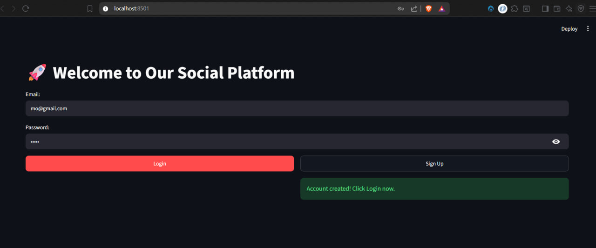
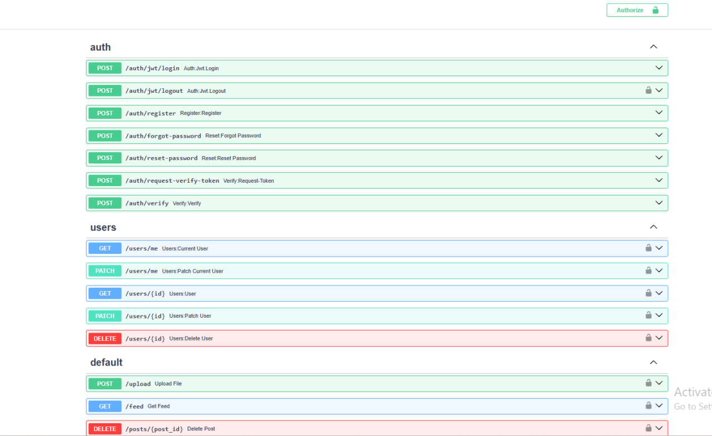
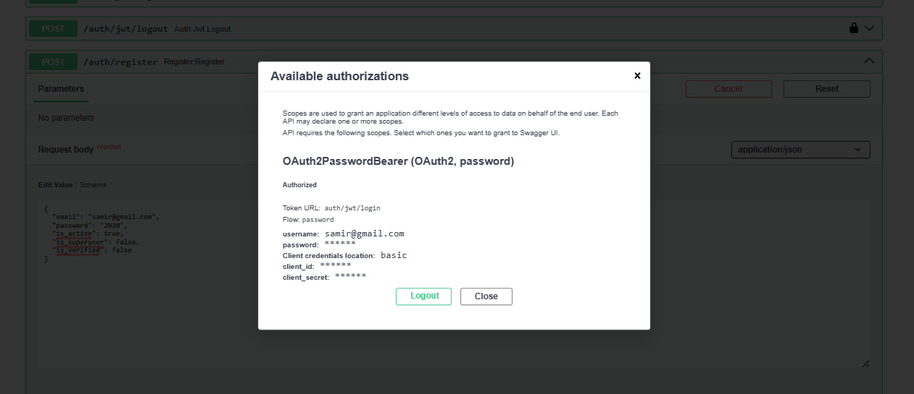
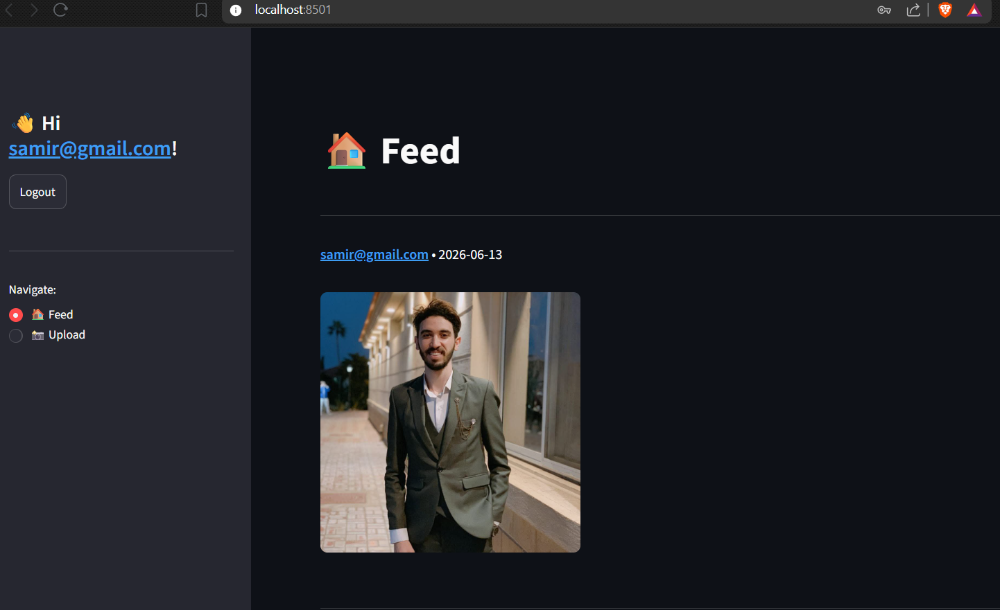

# Social Platform FastAPI + Streamlit

This project is a small social-media style app with a FastAPI backend and a Streamlit frontend.

Users can register, log in, upload images or videos with captions, view a feed, and delete their own posts. The backend stores posts in SQLite through SQLAlchemy and handles authentication with `fastapi-users`.

## Features

- User registration and JWT login.
- Protected profile endpoint for the current user.
- Media upload with caption support.
- Post feed ordered by newest first.
- Delete own posts.
- Streamlit UI for login, upload, and feed browsing.
- Local fallback storage for uploads if ImageKit is unavailable.

## Tech Stack

- Python 3.14+
- FastAPI
- Uvicorn
- SQLAlchemy 2.x async
- SQLite with `aiosqlite`
- fastapi-users
- ImageKit Python SDK
- Streamlit
- python-dotenv

## Folder Structure

```text
.
├── main.py
├── frontend.py
├── pyproject.toml
├── README.md
├── .env
├── .env.example
├── test_Upload/
│   ├── Sam.png
│   └── portfolio.png
├── app/
│   ├── app.py
│   ├── db.py
│   ├── images.py
│   ├── schemas.py
│   └── users.py
└── uploaded_media/
```

Notes:

- `uploaded_media/` is created automatically when ImageKit upload fails and the app falls back to local storage.
- `.env` stays local only. Use `.env.example` as the template.

## Environment Variables

Create a local `.env` file with:

```env
IMAGEKIT_PRIVATE_KEY=your_private_key
IMAGEKIT_PUBLIC_KEY=your_public_key
IMAGEKIT_URL=https://ik.imagekit.io/your_imagekit_id
```

Do not commit `.env` to git.

## Setup

1. Install dependencies.

```bash
uv sync
```

2. Create `.env` from `.env.example` and fill in your ImageKit keys.

3. Run the backend.

```bash
uv run python main.py
```

4. Run the Streamlit frontend in another terminal.

```bash
uv run streamlit run frontend.py
```

5. Open the apps.

- FastAPI docs: http://127.0.0.1:8000/docs
- Streamlit app: the URL shown by Streamlit

## How It Works

1. A user registers with email and password.
2. The user logs in and gets a JWT token.
3. The Streamlit app sends the token with every protected request.
4. The upload endpoint tries ImageKit first.
5. If ImageKit fails, the app saves the file locally in `uploaded_media/` and returns a local `/media/...` URL.
6. The feed shows all posts and lets the owner delete their own posts.

## API Endpoints

### Auth

- `POST /auth/register` - create a new user.
- `POST /auth/jwt/login` - log in and get an access token.
- `GET /users/me` - get the current user profile.

### Posts

- `POST /upload` - upload an image or video with an optional caption.
- `GET /feed` - list all posts.
- `DELETE /posts/{post_id}` - delete your own post.

## Example Requests

### Register

```bash
curl -X POST http://127.0.0.1:8000/auth/register \
	-H "Content-Type: application/json" \
	-d '{"email":"user@example.com","password":"TestPass123!"}'
```

### Login

```bash
curl -X POST http://127.0.0.1:8000/auth/jwt/login \
	-H "Content-Type: application/x-www-form-urlencoded" \
	-d "username=user@example.com&password=TestPass123!"
```

### Upload a File

```bash
curl -X POST http://127.0.0.1:8000/upload \
	-H "Authorization: Bearer YOUR_TOKEN" \
	-F "file=@test_Upload/Sam.png" \
	-F "caption=Hello from the README"
```

### Get Feed

```bash
curl http://127.0.0.1:8000/feed \
	-H "Authorization: Bearer YOUR_TOKEN"
```

### Delete Post

```bash
curl -X DELETE http://127.0.0.1:8000/posts/POST_ID \
	-H "Authorization: Bearer YOUR_TOKEN"
```


# Screenshots

### Frontend Streamlit UI


## Endpoints


### Succesfull JWT Auth


### Succesfull Upload
